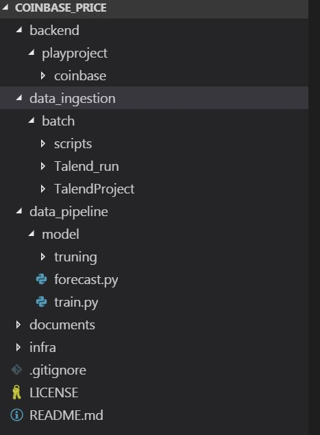
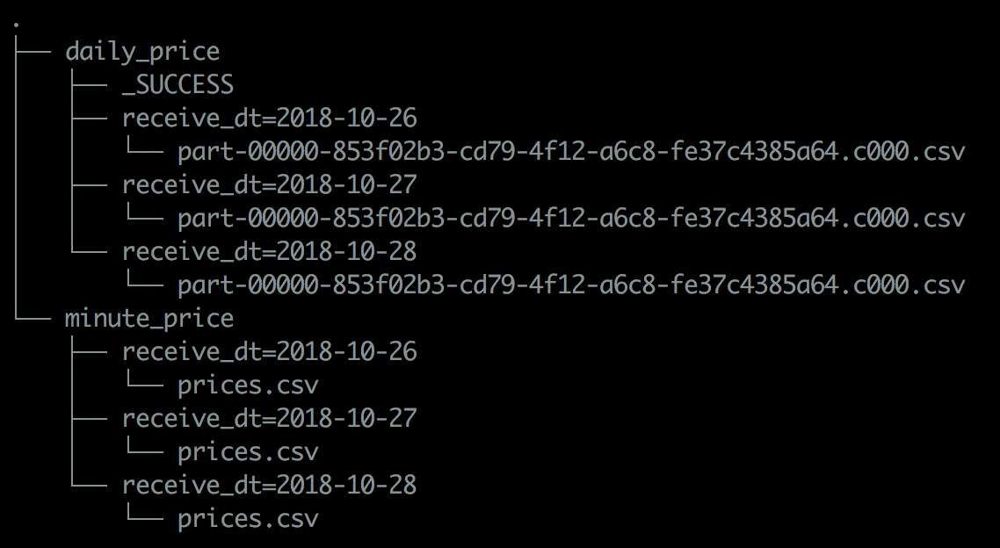
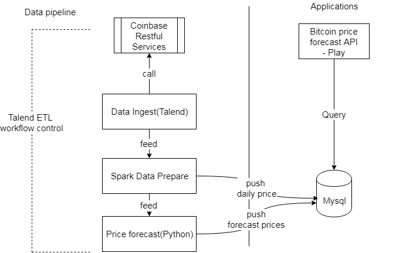
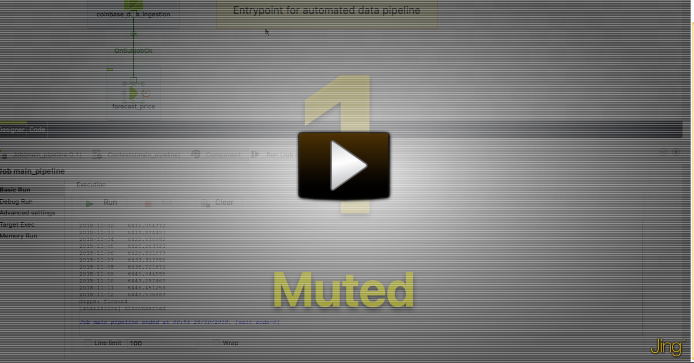
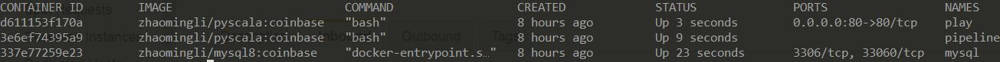
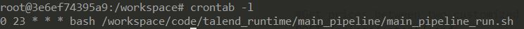
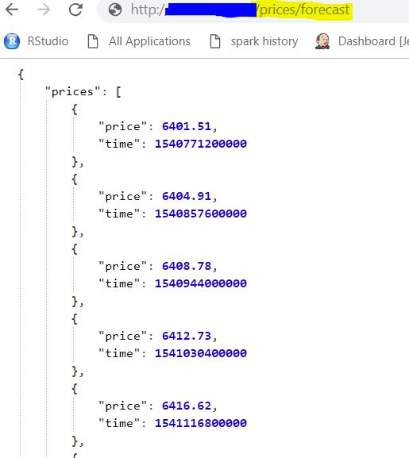

- [Project structures](#project-structures)
    - [Code structure](#code-structure)
    - [Datalake structure](#datalake-structure)
    - [Database catalog and schema](#database-catalog-and-schema)
- [Architecture and techiques](#architecture-and-techiques)
    - [Business requirement and system design principles](#business-requirement-and-system-design-principles)
        - [Business requirement](#business-requirement)
        - [Design principles](#design-principles)
    - [Architecture overview](#architecture-overview)
    - [Data storage](#data-storage)
    - [Data pipeline](#data-pipeline)
        - [Data pipeline deploy and run](#data-pipeline-deploy-and-run)
    - [Web APIs](#web-apis)
- [Data modeling and forecast](#data-modeling-and-forecast)
- [Installation requirement and steps](#installation-requirement-and-steps)
- [Future work](#future-work)


### Project structures
#### Code structure
The project code structure contains:
- backend, which is the API web project based on Play and Scala.
- data_ingestion, which is the data ingestion and transformation code and scripts based on Talend and Spark.
- data_pipeline, which is the bitcoin price forecasting model based on Python. 
- infra, where the docker build and deployment's resources and scripts are resided in.

#### Datalake structure
The data lake concept is introduced in this project since we want to keep all raw and massive volume of data(not now but maybe future) in a single data storage which can serve follow-up data analytics and services.
There are two layers in this data lake by data granularity, one is original raw layer from which the minutes level bitcoin prices data are collected, and another one is serve layer, where daily prices data are recomputed. This design follows data lake lambda architecture that batch layer and serve layer are implemented. The actually data lake structure is as below:

#### Database catalog and schema
As we want to have a SQL-compliant database which can serve both low-latency query respond and easy data analytics with SQL, Mysql8 is introduced in this project. There are two tables in the coinbase database which store daily prices and forecasted prices respectively.

### Architecture and techiques
Languages, frameworks and libraries used in this project:
- Scala + Play, for web API
- Python, for data modeling and forecasting
- Talend and Spark for data pipeline
- Mysql for API's backend storage
- HDFS/S3 (local FS) as data lake

#### Business requirement and system design principles
##### Business requirement
- Allowing users to see the bitcoin price movement for last week, last month or any custom date.
- Allowing users to see the x days rolling / moving average bitcoin prices between two custom dates.
- Allowing users to get the forecasted bitcoin price for next 15 days.
##### Design principles
- Datalake: raw, single version of truth
- Data prepare/analytics: SQL friendly
- Batch/ daily refresh
- Automate data pipeline
- API access - Low latency
- API application, low project dependency to data systems.

  
#### Architecture overview
The project architecture is composed of two main aspects, one is data pipeline which is responsible for data ingestion, data prepare and data model and forecasting. Another one is web application, an interface for users to access our data services.
Below is the overall architecture :

#### Data storage
From data lake perspective, the optimal storage will be AWS S3 or HDFS, as this project is not ready for scalability, we treat a specific folder at local drive as data lake.
As the web API application requires low latency responding and handy data analytics method(like SQL window function), we adopted a relational database, mysql8, as our API back-end data store. 
#### Data pipeline
- Data ingestion
Talend is a good tool to ingest data from a Restful API, as many great features available at Talend, developers take  minimum effort to implement a workflow.
- Data prepare
Spark is one of the best tools to transform and load data, as its Sparl SQL feature, many complex ETL logics can be handled by Spark SQL.
- Data modeling and forecast
Python comes to the way of modeling and forecasting as its abundant of data science packages.
See the video below about the data pipeline workflow:
[](https://www.screencast.com/t/1r5O5XnH)

##### Data pipeline deploy and run
As the whole data pipeline is model by Talend, we are ready to pick every pieces together to be able to run from single entrypoint. We simply using Linux `crontab` to schedule the Talend task to be run daily.

We deploy the bitcoint price projects into 3 dockers, one is dedicated for mysql database, one is for data pipeline and last one is for play application.
3 containers are up as: mysql, pipeline and play:

From data pipeline containers, we schedule the daily tasks as start from 23PM:


#### Web APIs
For POST APIs, the start and end parameters are in date format of `yyyy-MM-dd`, and xday parameter is type `int`.
The API's response is in `JSON` format.
Each API's signature is defined as below:
```sh
    #Get last week/month prices movement
    GET /prices/lastweek
    curl -X GET http://[COINBASE_APP_IP_ADDRESS]/prices/lastweek
    GET /prices/lastmonth
    curl -X GET http://[COINBASE_APP_IP_ADDRESS]/prices/lastmonth

    #Get prices between two customized dates
    POST /prices/:start/:end
    example: curl -X POST http://[COINBASE_APP_IP_ADDRESS]/prices/3/2018-03-01/2018-04-01

    #Get X days moving average prices between two customized dates
    POST /prices/:xday/:start/:end  
    example: curl -X POST http://[COINBASE_APP_IP_ADDRESS]/prices/3/2017-12-01/2017-12-26

    #Get 15 forecast prices
    GET /prices/forecast
    curl -X GET http://[COINBASE_APP_IP_ADDRESS]/prices/forecast
```
For instance, the forecast API will be requested and responded as it is below:


### Data modeling and forecast
This project using ARIMA algorithm to forecast bitcoin prices in 15 days.
See more at [data modeling note book](data_pipeline/model/tuning/workbook.md)
### Installation requirement and steps
- Requirment: Docker
- Install:
    Download this script [install.sh](infra/install/install.sh) and follow and adapt the commands in `install.sh`

### Future work
- Web API
    -  kubernete cluster deployment
    -  Security control (API permissions)
    -  Performance benchmark
    - Setting up a front end HTTP server
    - Configuring HTTPS
- Data lake
    - HDFS/S3 in production
- Data pipeline
    - Notification
    - Scheduler dashboard
- CI/CD
    - Jenkins/AWS CodeBuild+Docker
- Forecasting model
    -  improve precision
  