### Bitcoin price forecast model
Reference: https://www.kaggle.com/praneethji/bitcoin-price-prediction-with-arima
#### Data Exploration
```py
# Load data
import pandas as pd
import matplotlib.pyplot as plt
import numpy as np

dataPath = '/tmp/datalake/receive_dt=2018-10-26/prices.csv'
df = pd.read_csv(dataPath,index_col= 'time')
df.index = pd.to_datetime(df.index)
df = df.sort_index()
df.head()

#Split train and test
train = df.loc[:'2018-10-11']
test = df.loc['2018-10-12':]
test = test['price']
test = test.sort_index()

df = train
#Plot
df['price'].plot()
plt.ylabel("Daily Bitcoin price")
plt.show()

```

Price trend backward one year from now:

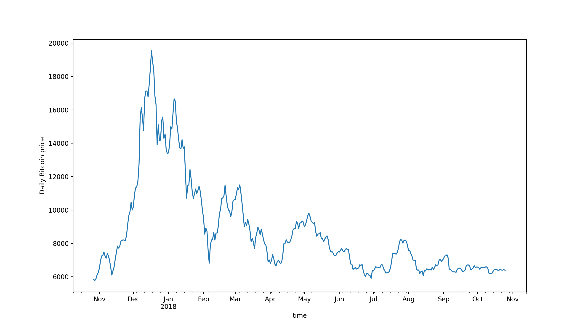

#### Stationarity check
```py
from statsmodels.tsa.stattools import adfuller
def test_stationarity(timeseries):
    #Determing rolling statistics
    rolmean = timeseries.rolling(30).mean()
    rolstd = timeseries.rolling(30).std()
    #Plot rolling statistics:
    orig = plt.plot(timeseries, color='blue',label='Original')
    mean = plt.plot(rolmean, color='red', label='Rolling Mean')
    std = plt.plot(rolstd, color='black', label = 'Rolling Std')
    plt.legend(loc='best')
    plt.title('Rolling Mean & Standard Deviation')
    plt.show(block=False)
    #Perform Dickey-Fuller test:
    print('Results of Dickey-Fuller Test:')
    dftest = adfuller(timeseries, autolag='AIC')
    dfoutput = pd.Series(dftest[0:4], index=['Test Statistic','p-value','#Lags Used','Number of Observations Used'])
    for key,value in dftest[4].items():
        dfoutput['Critical Value (%s)'%key] = value
    print(dfoutput)
ts = df['price']    
test_stationarity(ts)
```
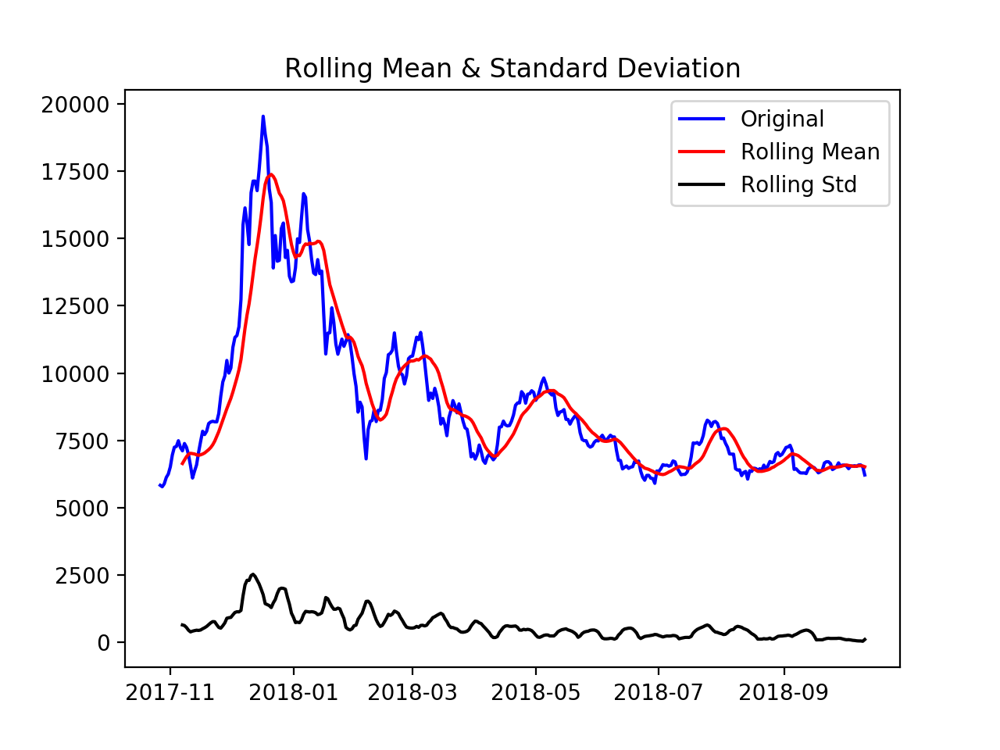

```text
Results of Dickey-Fuller Test:
Test Statistic                  -1.818401
p-value                          0.371365
#Lags Used                       1.000000
Number of Observations Used    348.000000
Critical Value (1%)             -3.449282
Critical Value (5%)             -2.869881
Critical Value (10%)            -2.571214
dtype: float64
```
Mean is not a stationary series and test statistic greater than critical value. **Series are not stationary**

#### Make series stationary
##### Eliminating trend
- Apply log transformation
```py
ts_log = np.log(ts)
plt.plot(ts_log)
```
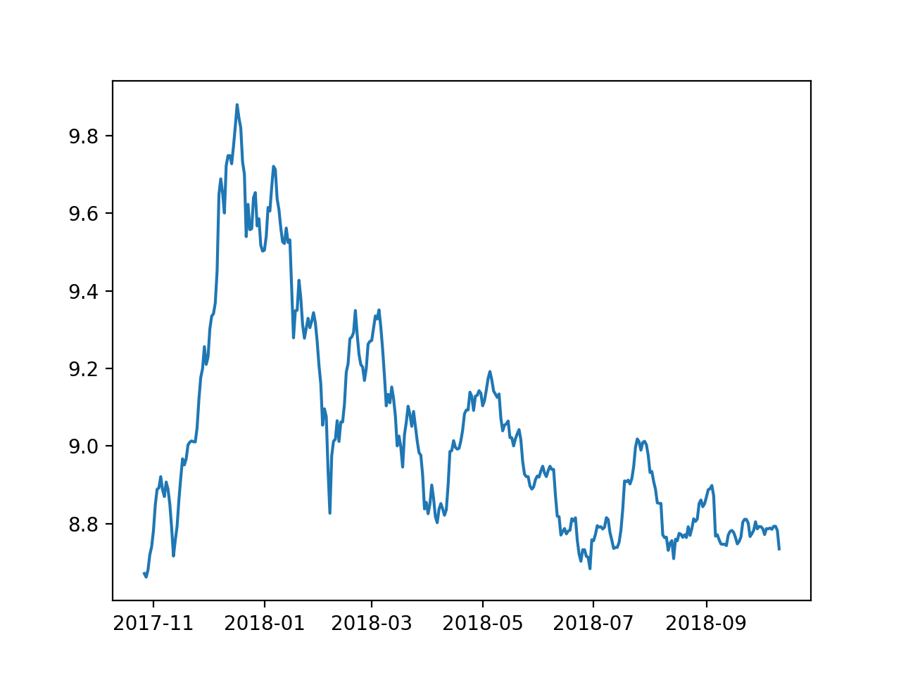
- Remove noise by smoothing - taking rolling averages
```py
moving_avg = ts_log.rolling(15).mean()
plt.plot(ts_log)
plt.plot(moving_avg, color='red')
```
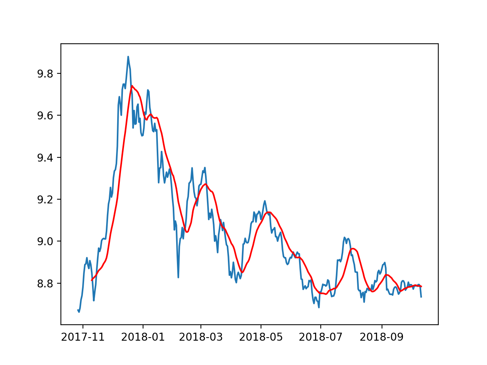

```py
ts_log_moving_avg_diff = ts_log - moving_avg
ts_log_moving_avg_diff.head(15)
ts_log_moving_avg_diff.dropna(inplace=True)
test_stationarity(ts_log_moving_avg_diff)
```
Series of difference of log price and rolling average
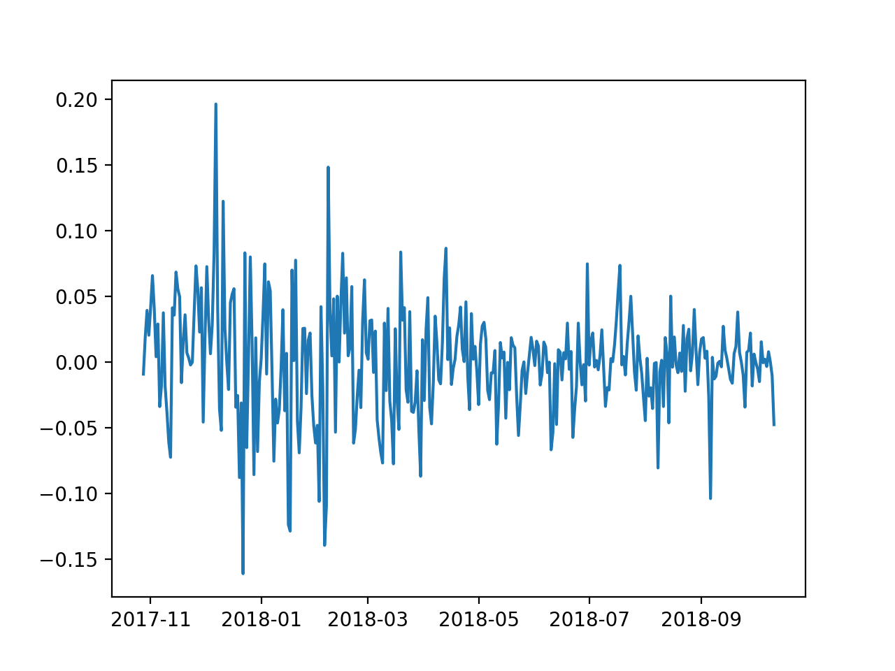
```text
Test Statistic                  -4.095683
p-value                          0.000985
#Lags Used                       1.000000
Number of Observations Used    334.000000
Critical Value (1%)             -3.450081
Critical Value (5%)             -2.870233
Critical Value (10%)            -2.571401
```
Test statistic less than 1% critical value, we can say 99% confidence: stationary series

- Exponentially weighted moving average, more recent value are given a higher weight.
  
```py
expwighted_avg = ts_log.ewm(halflife=7,min_periods=0,adjust=True,ignore_na=False).mean()
plt.plot(ts_log)
plt.plot(expwighted_avg, color='red')
```
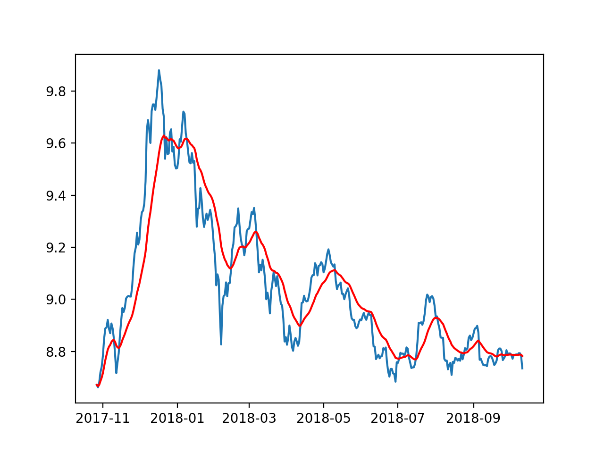
Check stationary
```py
ts_log_ewma_diff = ts_log - expwighted_avg
test_stationarity(ts_log_ewma_diff)
```
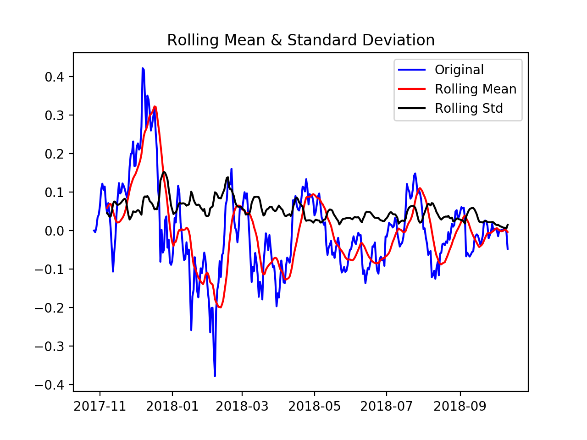
```text
Test Statistic                  -3.732244
p-value                          0.003682
#Lags Used                       1.000000
Number of Observations Used    348.000000
Critical Value (1%)             -3.449282
Critical Value (5%)             -2.869881
Critical Value (10%)            -2.571214
```
This time series is worse than the previous one since previous test statistic is greater.

- Eliminate trend and seasonality for first time series by differencing
  
```py
ts_log_diff = ts_log - ts_log.shift()
plt.plot(ts_log_diff)  
plt.show()
```


```py
ts_log_diff.dropna(inplace=True)
test_stationarity(ts_log_diff)
```

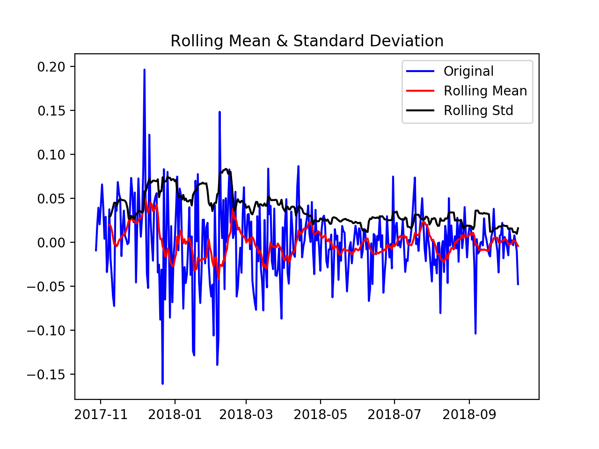
```text
Results of Dickey-Fuller Test:
Test Statistic                -1.500778e+01
p-value                        1.066479e-27
#Lags Used                     0.000000e+00
Number of Observations Used    3.480000e+02
Critical Value (1%)           -3.449282e+00
Critical Value (5%)           -2.869881e+00
Critical Value (10%)          -2.571214e+00  
```
Test statistic is significantly lower than 1% critical value.

### Forecasting using ARIMA
#### ACF and PACF
Find ARIMA parameters, p,q and d
```py
from statsmodels.tsa.stattools import acf, pacf
lag_acf = acf(ts_log_diff, nlags=30)
lag_pacf = pacf(ts_log_diff, nlags=30, method='ols')
#Plot ACF: 
plt.subplot(121) 
plt.plot(lag_acf)
plt.axhline(y=0,linestyle='--',color='gray')
plt.axhline(y=-1.96/np.sqrt(len(ts_log_diff)),linestyle='--',color='gray')
plt.axhline(y=1.96/np.sqrt(len(ts_log_diff)),linestyle='--',color='gray')
plt.title('Autocorrelation Function')

#Plot PACF:
plt.subplot(122)
plt.plot(lag_pacf)
plt.axhline(y=0,linestyle='--',color='gray')
plt.axhline(y=-1.96/np.sqrt(len(ts_log_diff)),linestyle='--',color='gray')
plt.axhline(y=1.96/np.sqrt(len(ts_log_diff)),linestyle='--',color='gray')
plt.title('Partial Autocorrelation Function')
plt.tight_layout()
plt.show()
```

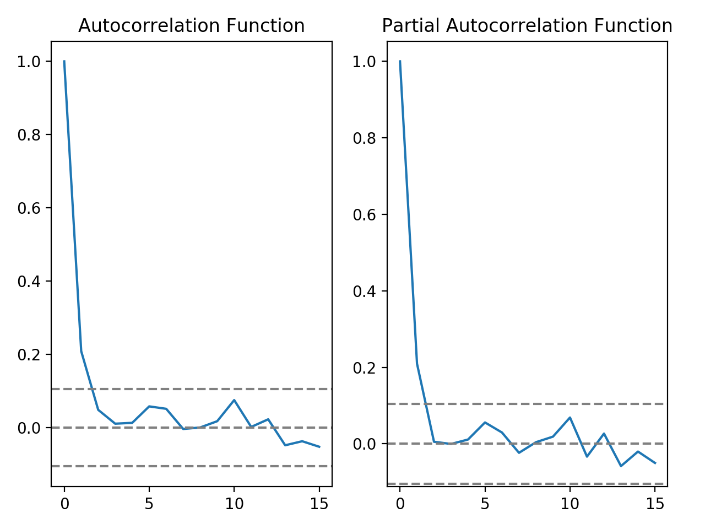

From PACF, p = 2; from ACF p = 2

#### Generate ARIMA models

- AR model
```py
from statsmodels.tsa.arima_model import ARIMA
model = ARIMA(ts_log, order=(2, 1, 0))  
results_AR = model.fit(disp=-1)  
plt.plot(ts_log_diff)
plt.plot(results_AR.fittedvalues, color='red')
plt.title('RSS: %.4f'% sum((results_AR.fittedvalues-ts_log_diff)**2))
plt.show()
```
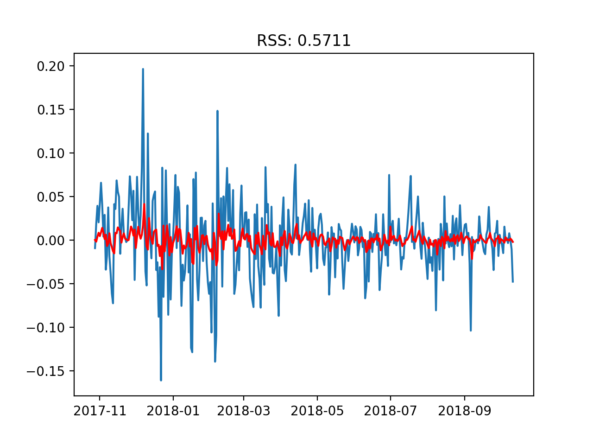

- MA model
```py
model = ARIMA(ts_log, order=(0, 1, 2))  
results_MA = model.fit(disp=-1)  
plt.plot(ts_log_diff)
plt.plot(results_MA.fittedvalues, color='red')
plt.title('RSS: %.4f'% sum((results_MA.fittedvalues-ts_log_diff)**2))
plt.show()
```


- Combined model
```py
model = ARIMA(ts_log, order=(2, 1, 2))  
results_ARIMA = model.fit(disp=-1)  
plt.plot(ts_log_diff)
plt.plot(results_ARIMA.fittedvalues, color='red')
plt.title('RSS: %.4f'% sum((results_ARIMA.fittedvalues-ts_log_diff)**2))
plt.show()
```
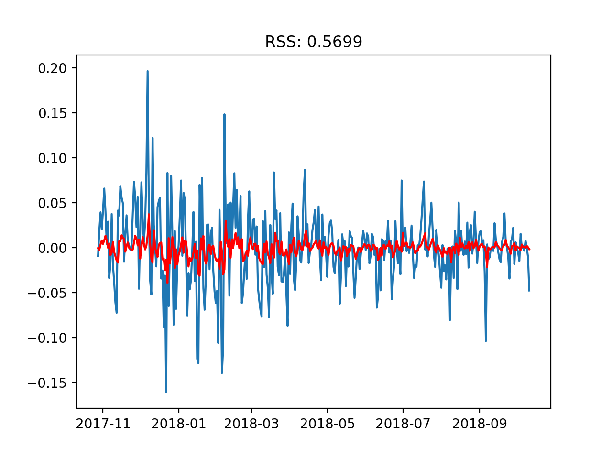

- Back to original scale
```py
predictions_ARIMA_diff = pd.Series(results_ARIMA.fittedvalues, copy=True)
print(predictions_ARIMA_diff.head())

predictions_ARIMA_diff_cumsum = predictions_ARIMA_diff.cumsum()
print(predictions_ARIMA_diff_cumsum.head())

predictions_ARIMA_log = pd.Series(ts_log.ix[0], index=ts_log.index)
predictions_ARIMA_log = predictions_ARIMA_log.add(predictions_ARIMA_diff_cumsum,fill_value=0)
predictions_ARIMA_log.head()

predictions_ARIMA = np.exp(predictions_ARIMA_log)
plt.plot(ts)
plt.plot(predictions_ARIMA)
plt.title('RMSE: %.4f'% np.sqrt(sum((predictions_ARIMA-ts)**2)/len(ts)))

```
Combined(AR amd MA) ARIMA model:
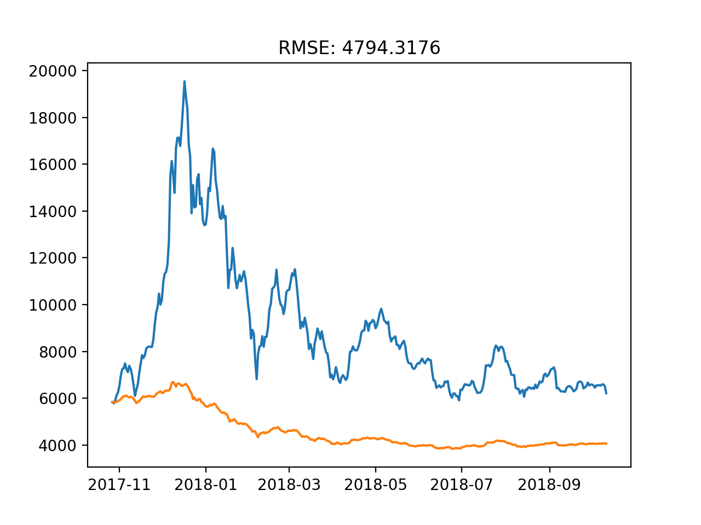

Model summary
```py
print(results_ARIMA.summary())
```
#### Forecast
```py
from sklearn.metrics import mean_squared_error

dates = [pd.Timestamp('2018-10-12'),pd.Timestamp('2018-10-13'),pd.Timestamp('2018-10-14'),pd.Timestamp('2018-10-15'),pd.Timestamp('2018-10-16'),pd.Timestamp('2018-10-17'),pd.Timestamp('2018-10-18'),pd.Timestamp('2018-10-19'),pd.Timestamp('2018-10-20'),pd.Timestamp('2018-10-21'),pd.Timestamp('2018-10-22'),pd.Timestamp('2018-10-23'),pd.Timestamp('2018-10-24'),pd.Timestamp('2018-10-25'),pd.Timestamp('2018-10-26')]

forecast = pd.Series(results_ARIMA.forecast(steps=15)[0],dates)
forecast = np.exp(forecast)
print(forecast)
error = mean_squared_error(test, forecast)
print('Test MSE: %.3f' % error)
```
```text
2018-10-12    6156.017374
2018-10-13    6145.454657
2018-10-14    6147.684873
2018-10-15    6153.291804
2018-10-16    6159.727535
2018-10-17    6166.301801
2018-10-18    6172.828134
2018-10-19    6179.256793
2018-10-20    6185.575148
2018-10-21    6191.780634
2018-10-22    6197.873417
2018-10-23    6203.854397
2018-10-24    6209.724668
2018-10-25    6215.485370
2018-10-26    6221.137652
```
Test MSE: 40678.795

```py
plt.plot(forecast, color ='green', label ='Predicted rates')
plt.plot(test, color = 'red', label = 'Observed from test data')
plt.title('RMSE: %.4f' % np.sqrt(sum((forecast-test)**2)/len(df)))
plt.legend(loc = 'best')
plt.show()
```
Forecasted 15 days prices:
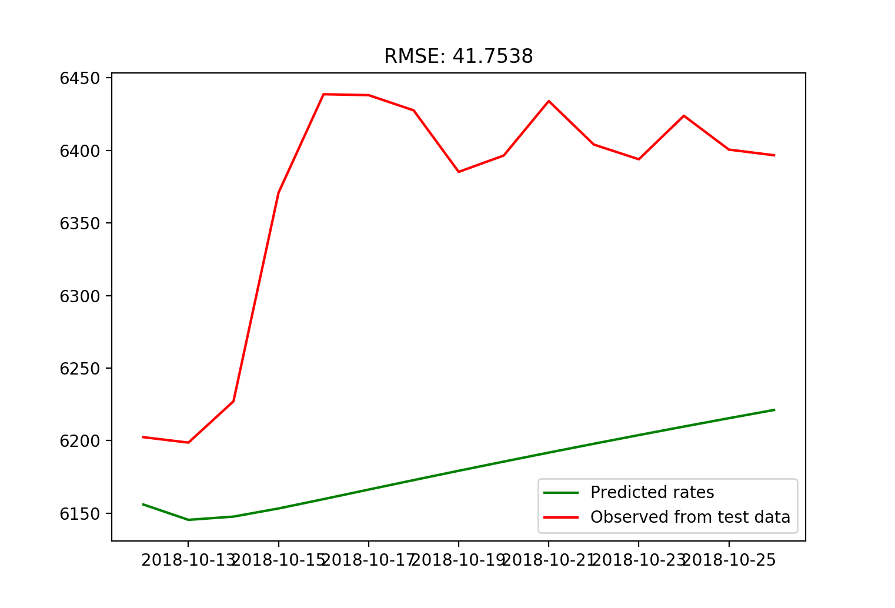